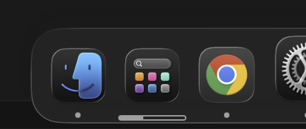
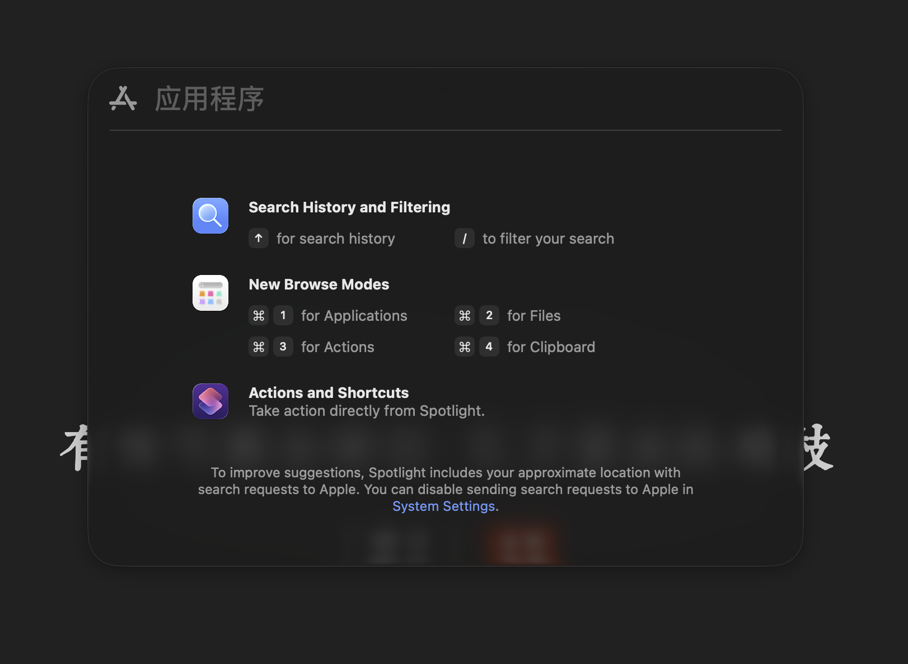
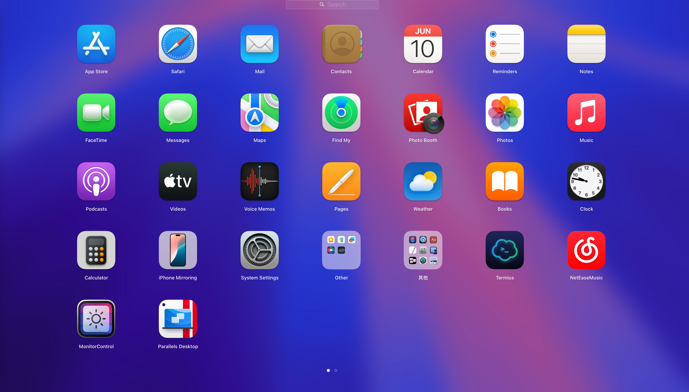

# launchpadx

Apple, give me back my launcher pad!

## What is this?

Today, I happily upgraded to the latest macOS system.

When I clicked the App button in the Dock, I was shocked to see that my launcher pad was gone!





WTF? Why would Apple remove the launcher pad? The last time a company removed the start menu was when Windows 8 was killed.

Come back, my launcher pad!



## Usage

Run this program, get back your launcher pad!

## Install

```bash
brew install --cask launchpadx
```
